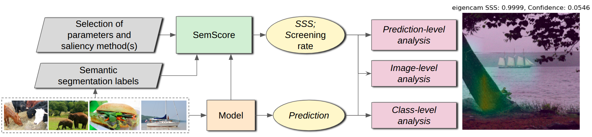

# SemScore

Official repository for SemScore: Practical Explainable AI through Quantitative Methods to Measure Semantic Spuriosity, published and spotlighted for an oral presentation at the [3rd Workshop on Regulatable ML at NeurIPS2025](https://regulatableml.github.io/).



Abstract:

> Mispredictions caused by spuriosity and flawed model reasoning remain challenges in predictive machine learning and artificial intelligence; Explainable AI (XAI) aims to mitigate these issues by tackling model interpretability and explanability, guided by principles such as explanation accuracy and knowledge limits. However, these principles are largely qualitative, leaving researchers with few actionable tools to quantify issues like spuriosity, limiting their usefulness in AI development and research. This gap is problematic as it leaves researchers to perform laborious, manual techniques to assess individual model predictions—assessments that are subject to errors of human judgment. We introduce SemScore, an extensible toolkit that applies a novel method to determine the semantic relevance of models by quantifying visual explanation methods through semantic segmentation datasets. By comparing visual explanation methods against ground-truth semantics, SemScore evaluates models on spuriosity, enabling researchers to systematically measure and quantify the semantic understanding of models. This provides a useful and actionable toolkit for understanding model biases and behavior. We apply SemScore to various computer vision domains and demonstrate that SemScore can effectively evaluate and discern between models based on their semantic reasoning capabilities. As the first practical method for quantifying semantic understanding through spuriosity analysis, SemScore significantly advances the capabilities for XAI research. We release the SemScore toolkit and experimentation code publicly to provide researchers with the means to build more semantically relevant models and to extend our work into additional domains.

Our paper is accessible [here](https://openreview.net/pdf?id=aTOZqUGRCQ).

## Installation and prerequisites

We recommend using Python 3.12 together with a CUDA-compatible GPU running CUDA 12.6, as these are the exact versions we used in all experiments reported in the paper. This configuration has been fully tested and verified to work with the SemScore toolkit.

### 1. Create and set up Conda environment

We recommend creating a Conda environment to manage your Python libraries and dependencies required for our experiments.

```bash
conda create -n semscore python=3.12.6
conda activate semscore
pip install -r requirements.txt
```

### 2. Download relevant datasets

Instructions to download the relevant datasets can be found through the README in the [data](https://github.com/JovinLeong/SemScore/tree/main/data) directory.

## Getting started

To visualise how we obtain the Semantic Spuriosity Score (SSS), you can access the demo notebook [here](https://github.com/JovinLeong/SemScore/blob/main/demo/sss_map_visualisations.ipynb). Otherwise, you can follow the instructions below to start using SemScore.

### 1. Configure desired pipelines

The main experiment pipelines are located in the [pipelines](https://github.com/JovinLeong/SemScore/tree/main/pipelines) directory.
Before running them, review the [model configuration files](https://github.com/JovinLeong/SemScore/tree/main/pipelines/model_config) in `pipelines/model_config` and ensure the dataset paths and settings are correct. Then specify the models you want to evaluate.

A detailed README on running the pipelines can also be found within the directory.

### 2. Run pipeline

Once configurations are set, run the corresponding pipeline script.
All outputs (saliency maps, SSS scores, logs) will be saved to the [outputs](https://github.com/JovinLeong/SemScore/tree/main/outputs) directory.

### 3. Evaluate results

The [evaluation](https://github.com/JovinLeong/SemScore/tree/main/evaluation) directory contains scripts and notebooks for aggregating per-prediction, image-level, and class-level SSS, comparing model spuriosity across architectures and visualizing saliency maps and SSS distributions. A demo notebook showcasing how we evaluated the outputs can be found [here](https://github.com/JovinLeong/SemScore/blob/main/demo/run_evaluation.ipynb).

A detailed README on running evaluations can also be found within the directory.

## Citation

```
@inproceedings{
leong2024semscore,
title={SemScore: Practical Explainable AI through Quantitative Methods to Measure Semantic Spuriosity},
author={Jovin Leong and Wei May Chen and Tiong Kai Tan},
booktitle={The Third Workshop on Regulatable Machine Learning at The Thirty-Ninth Annual Conference on Neural Information Processing Systems},
year={2025},
url={https://openreview.net/pdf?id=aTOZqUGRCQ}
}
```